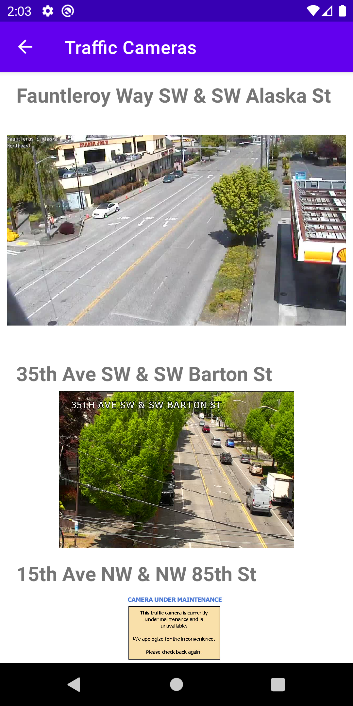
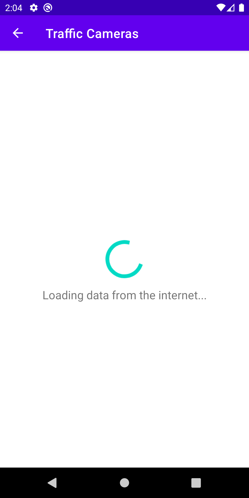
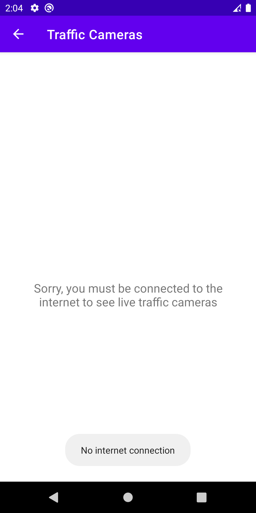
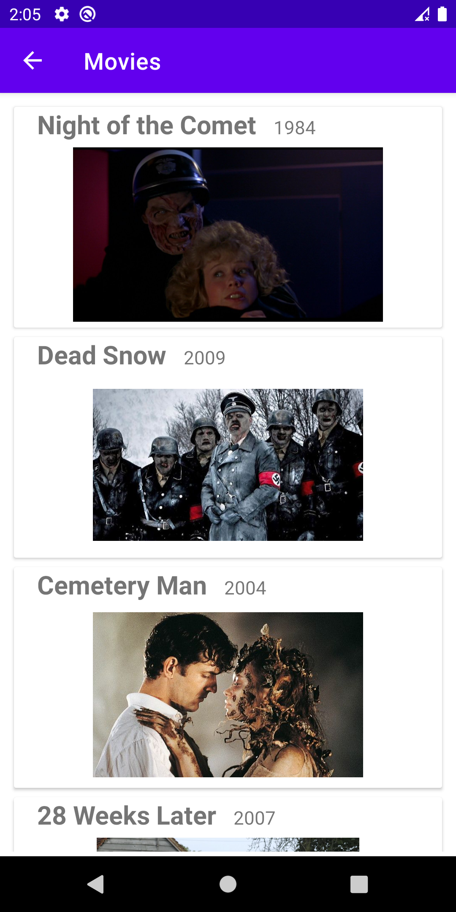
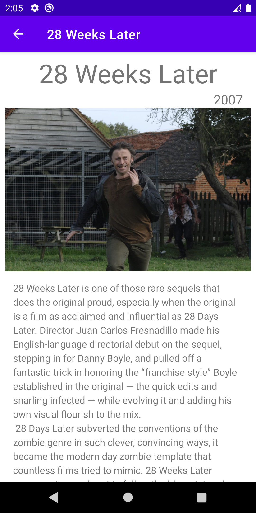
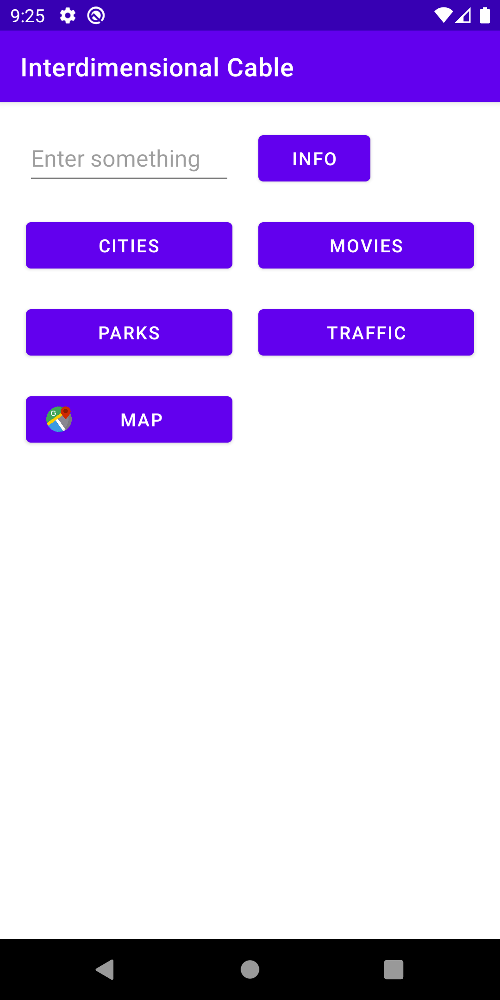

# Currently on: HW 4 Live Cams

Practice making API requests with Retrofit & GSON, model JSON response into Kotlin Data Classes, checking network status and handling graceful failure

Screenshots:

---------

## HW 3: Zombie Activity

Practice rendering list and navigation with RecycleView, Adapter, Intent, Bundle and Picasso

Screenshots:  

---------

## HW 2: UI Layout

Practice positioning UI elements with XML, GridLayout, and button functionality through onClickListener and Toast

> This is a homework project for AD340 Android Development @ North Seattle College, Spring 2021
